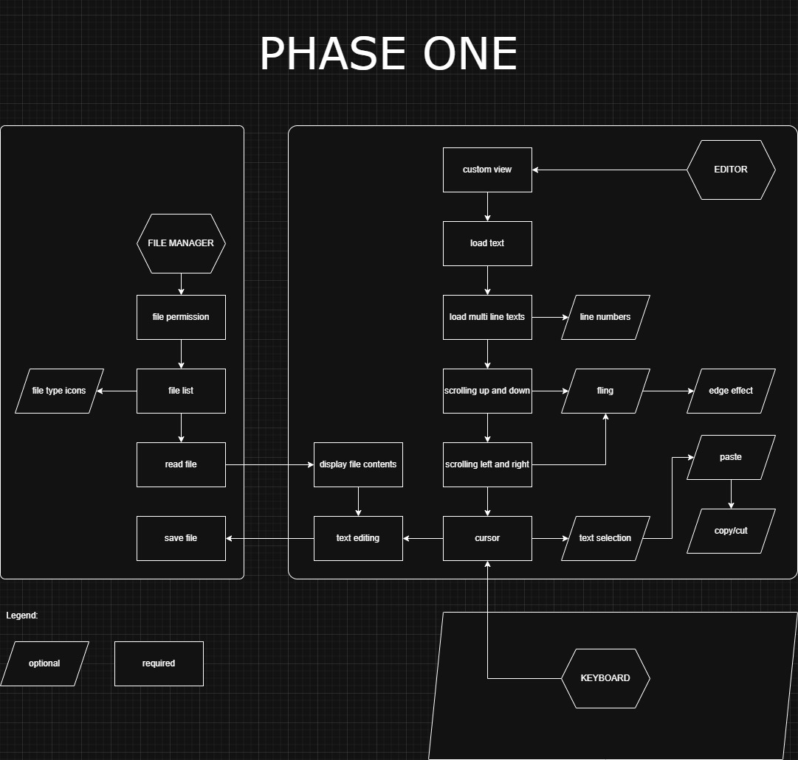

# peanut-editor
a true quick code editor for android written in java. no vibe coding:)

## the plan :D

## history :D
here are some attempts on trying to create a code editor:
- [IMOaswell/frog](https://github.com/IMOaswell/frog) (May 17, 2024)
- [IMOaswell/Nuts](https://github.com/IMOaswell/Nuts) (Jul 19, 2024)
- [IMOitself/text](https://github.com/IMOitself/text) (Sep 2, 2024)
- [IMOitself/peanut](https://github.com/IMOitself/peanut) (Nov 12, 2024)
- [IMOitself/t](https://github.com/IMOitself/t) (Jan 30, 2025)
- [IMOitself/text_editor_prototype1](https://github.com/IMOitself/text_editor_prototype1) (May 1, 2025)

most of them failed.  probably because i end up micro managing unnecessary stuffs.

## background

  

    do u really want to read a long ahh text... 
  

   
- i first learned coding a mobile app on a low end phone using **Sketchware** *(removed from playstore)*.
- there are almost no tutorials on how to use it and the community is very small.
- i barely even understand java because there is no typing involved. its all drag-and-drop similar to scratch (mit).
- after a while i moved on to **AIDE** *(also removed from playstore)*.
- its a very steep learning curve and so frustrating to use.
- it took me about 3 years to fully grasp android java and develop apps more easily.
- eventually i was fortunate enough to have a laptop.
- but still, the experience i got from coding on a phone is unmatched.
- its very unheard of because all of the tools for coding are available on pc and very limited on mobile devices.
- but the difference is that its super convenient and more productive, imo.
- besides u can code anywhere and in any position u want not just sitting and staring on a computer screen.
- that is why i want to create an app that is easy to use and faster to develop on. at least in my opinion.

told u its long.

